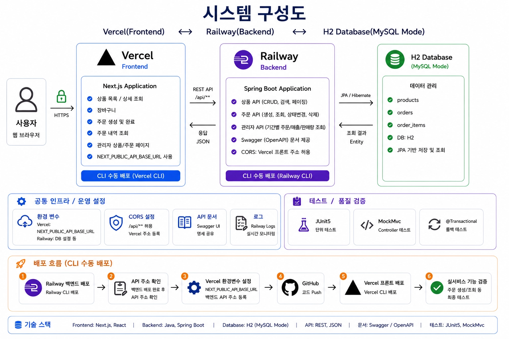
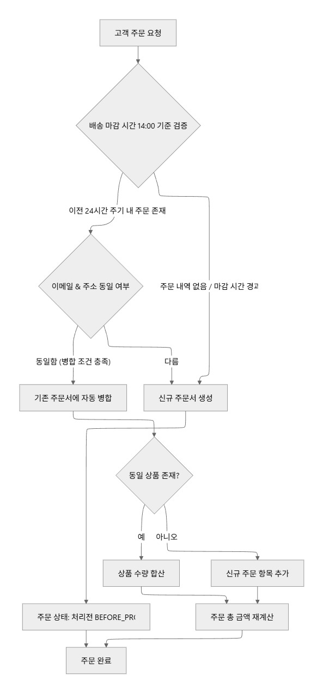
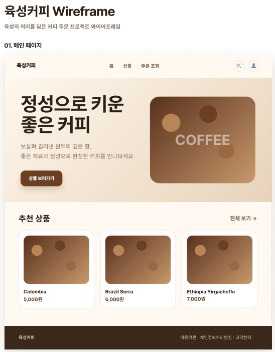
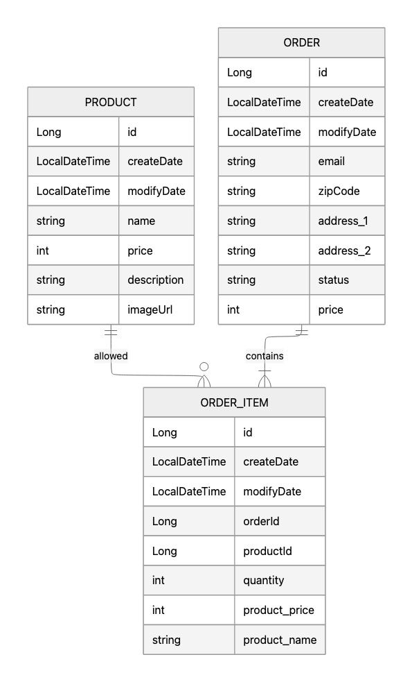

# ☕ 커피 원두 관리 및 비회원 주문 자동화 서비스

> **데브코스 백엔드 10기 12회차 1차 프로젝트 (6팀: 육성)**
>
> 복잡한 가입 절차 없이 이메일과 배송지 정보만을 활용해 편리하게 커피 원두를 구매할 수 있는 **비회원 주문 자동화 서비스**입니다.  
> 커머스 도메인의 핵심인 **당일 마감 전 주문 자동 합산** 및 **오후 2시 기준 배송 마감 스케줄러**와 같은 백엔드 비즈니스 로직을 안정적으로 처리합니다.

- **프로젝트 기간**: 2026.06.04(목) ~ 2026.06.11(목)
- **프론트엔드 배포 (Vercel)**: [서비스 바로가기](https://nbe10-12-1-team6.vercel.app/)
- **백엔드 API (Swagger/Railway)**: [Swagger API 문서](https://nbe10-12-1-team6-production.up.railway.app/swagger-ui/index.html#/)

---

## 🛠 기술 스택

### Backend
- **Core**: Java 25 (Railway 배포 환경: Java 21), Spring Boot 4.0.6
- **Database & ORM**: H2 Database (In-Memory), Spring Data JPA
- **API Documentation**: Springdoc OpenAPI (Swagger)
- **Other**: Lombok, Spring Validation, Spring AOP (상태코드 매핑용 Aspect)

### Frontend
- **Framework**: Next.js, React

---

## 📐 시스템 구성도

---

## ✨ 핵심 비즈니스 규칙

### 1. 비회원 식별 및 주문 인증
- **비회원 식별**: 별도의 회원가입 없이 **이메일 주소**를 고유 식별값으로 사용하며, 유효한 이메일 형식인지 필수로 검증합니다.
- **주문 조회 및 취소**: 고객은 주문 시 입력한 이메일로 주문 내역을 조회할 수 있으며, 배송 시작 전인 **'처리전(BEFORE_PROCESSING)'** 상태의 주문에 한해서만 취소(삭제)할 수 있습니다.

### 2. 당일 마감 전 주문 자동 합산 (합포장)
- **주문 자동 합산**: 동일 배송 주기 내에 **이메일과 배송 주소(우편번호 포함)가 완전히 일치**하는 추가 주문이 들어오면, 기존 주문서에 자동으로 통합됩니다.
- **합산 방식**: 
  - 동일한 상품은 수량이 누적됩니다.
  - 새로운 상품은 기존 주문서의 품목 리스트에 추가됩니다.
  - 주문 총 금액은 상품 추가/수량 변경 시 자동으로 재계산됩니다.
  

### 3. 오후 2시 배송 마감 및 이월 스케줄러
- **배송 마감**: 당일 발송을 위한 주문 취합 및 마감 시각은 매일 오후 2시(14:00)로 제한됩니다.
- **주문 이월**: 
  - **오후 2시 이전** 주문: 당일 배송 주기로 묶여 당일 출고 준비를 합니다.
  - **오후 2시 이후** 주문: 다음 날 배송 주기로 **자동 이월**되며, 이전 주문서와 합산되지 않고 **독립된 신규 주문서**로 생성됩니다.

---

## 🚀 심화 구현 내용

### 1. 데이터 분석 및 조회 (관리자 기능)
- **통계 대시보드**: 기간별 매출 통계 및 기간별 최다 판매 상품 3개의 판매량 조회 쿼리를 작성하여 비즈니스 지표를 시각화합니다.
- **서버 사이드 페이징 및 검색**:
  - **주문 검색**: 주문일, 주문 상태, 배송 상태 기반 검색 및 페이징 처리를 지원합니다.
  - **상품 검색**: 상품명, 상품 설명 기반 검색 및 페이징 처리를 지원합니다.

### 2. 테스트 및 품질 검증
- **JUnit5 및 MockMvc** 기반으로 상품 CRUD, 주문 생성/조회/상태 변경/삭제 등 핵심 API 기능 테스트를 완료했습니다.
- **경계 조건 테스트**: 오후 2시 마감 스케줄러의 정상 작동을 확인하기 위해 **13:59:59**와 **14:00:00** 주문 생성 시점의 경계값 테스트 및 예외(존재하지 않는 상품, 이메일 미입력, 형식 오류 등) 케이스를 검증했습니다.
- **테스트 데이터 독립성**: `@Transactional`을 사용하여 테스트 완료 후 자동으로 롤백을 처리해 데이터 독립성을 확보했습니다.

---

## 🎨 와이어 프레임 & ERD

### 와이어 프레임 (메인 페이지)

### ERD (Entity Relationship Diagram)

---

## 👥 역할 분담
| 팀원 | 역할 | 담당 업무 |
| :---: | :---: | --- |
| **이준형 (팀장)** | 백엔드 | 주문 API 및 주문 관리 기능 구현 |
| **이지헌** | 백엔드 | 주문 핵심 비즈니스 로직 및 스케줄러 구현 |
| **문은지** | 백엔드 | 상품 관리 기능 (CRUD API) 구현 |
| **김대연** | 백엔드 | 테스트 코드 작성 및 검증, 클라우드 서비스를 활용한 배포 |
| **손홍준** | 프론트엔드 | 프론트엔드 개발 및 전역 설정 |

---

## 📝 개발 규칙 및 컨벤션

### 1. 브랜치 전략 (GitHub-Flow 기반)
- **`main`**: 최종 배포용 브랜치 (언제든 실행 가능한 상태 유지)
- **`feat/기능명`** 또는 **`기능-이름`**: 각자 맡은 기능을 개발하고 수정하는 브랜치

### 2. 커밋 메시지 컨벤션
메시지 첫 글자는 아래 태그 중 하나로 시작하며, `태그: 한 줄 요약` 형태로 작성합니다.

| 태그 | 언제 사용하나요? | 예시 |
| :---: | --- | --- |
| **`feat`** | 새로운 기능 개발 및 추가 | `feat: 상품 등록 및 이미지 URL 저장 기능 구현` |
| **`fix`** | 버그 및 오류 수정 | `fix: 오후 2시 마감 스케줄러 시간대 오류 수정` |
| **`docs`** | 문서 수정 (기획서, README 등) | `docs: 기획서 1.3 기술 스택 버전 업데이트` |
| **`refactor`** | 기능은 그대로 두고 코드만 정리 | `refactor: OrderItem 엔티티 연관관계 매핑 최적화` |
| **`test`** | 테스트 코드 추가 및 수정 | `test: 주문 자동 합산 로직 단위 테스트 추가` |
| **`chore`** | 빌드 설정, 의존성 패키지 관리 등 | `chore: build.gradle에 MySQL 드라이버 의존성 추가` |

### 3. Pull Request(PR) 및 코드 리뷰 규칙
- **최소 1명 이상의 승인(Approve) 필수**: 작업한 기능 브랜치를 merge하기 전, 백엔드 팀원 중 최소 1명 이상이 코드를 리뷰하고 승인해야 머지가 가능합니다.
- **CORS 및 의존성 충돌 방지**: 프론트엔드와 백엔드가 교차하는 지점이나 `build.gradle`이 변경되는 PR은 슬랙이나 메신저로 팀원에게 사전에 공지하고, 함께 확인한 후 머지합니다.
